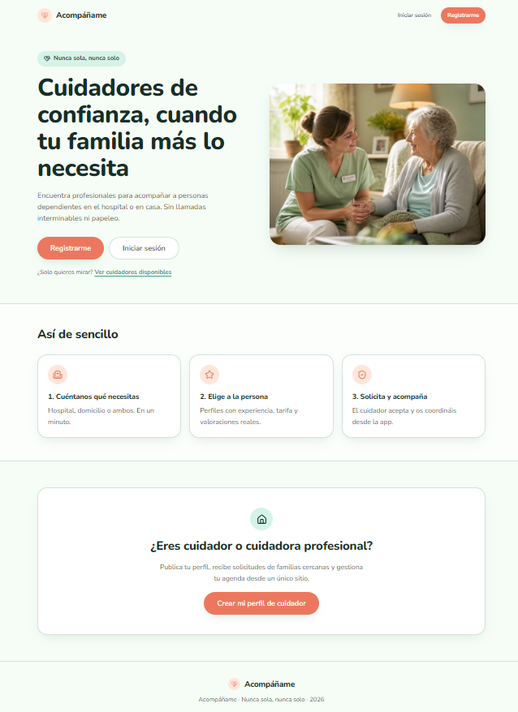
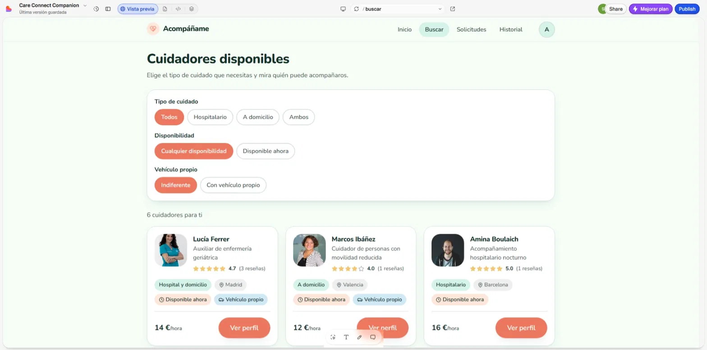
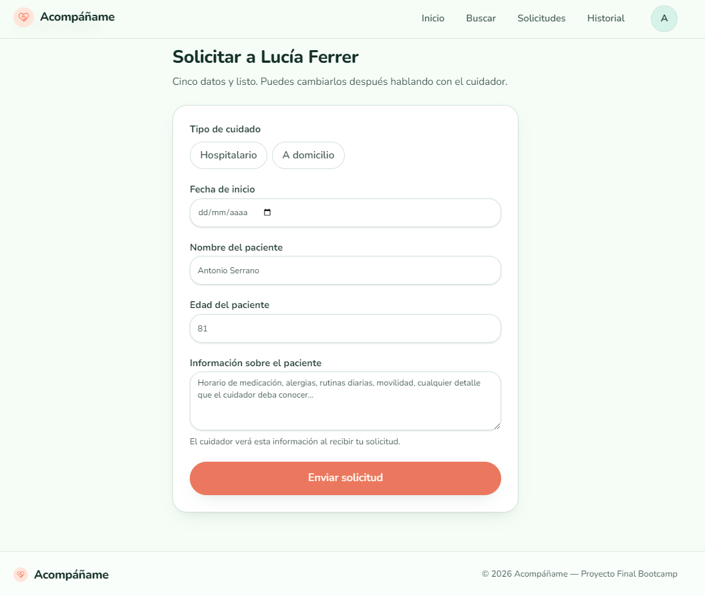
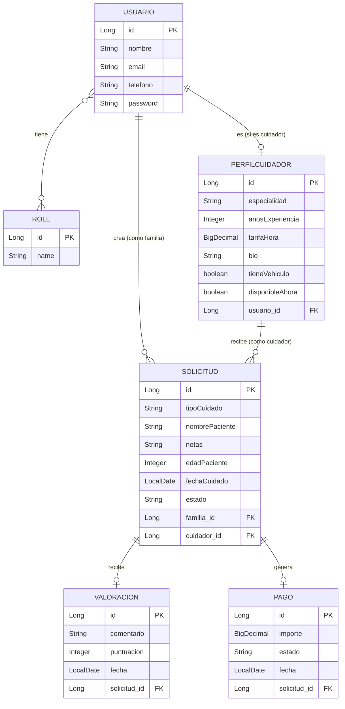
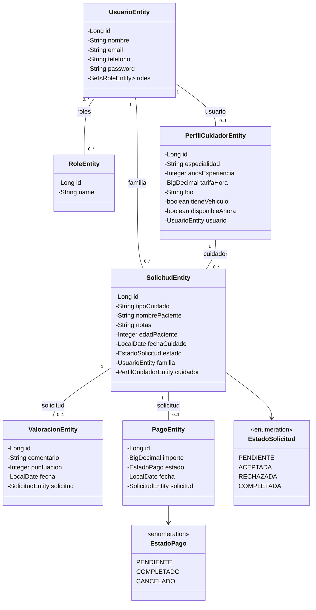

Esta estructura separa claramente responsabilidades: las **vistas** (`views/`) representan pantallas completas, los **componentes** (`components/`) contienen piezas reutilizables entre vistas, los **repositorios** (`repositories/`) encapsulan toda la comunicación con la API, el **store** (`stores/`) centraliza el estado de sesión, y los **estilos globales** (`styles/`) evitan duplicar valores de diseño (colores, espaciados) en cada archivo.

## 📱 Pantallas implementadas

| # | Pantalla | Descripción |
|---|---|---|
| 1 | 🏠 **Landing** | Página pública de bienvenida, con propuesta de valor y accesos a registro/login |
| 2 | ✍️ **Registro** | Formulario con selección de rol (Familia / Cuidador), cargado dinámicamente desde la API |
| 3 | 🔑 **Inicio de sesión** | |
| 4 | 🔍 **Búsqueda de cuidadores** | Listado con filtros por tipo de cuidado, disponibilidad y vehículo propio |
| 5 | 🧑‍⚕️ **Perfil de cuidador** (público) | Datos profesionales, valoración media y reseñas de familias |
| 6 | 📝 **Solicitud de servicio** | Formulario para pedir el acompañamiento a un cuidador concreto |
| 7 | ✅ **Confirmación de solicitud** | |
| 8 | 📜 **Historial de solicitudes** (Familia) | Estado final de cada acompañamiento gestionado, con acceso a valorar |
| 9 | 📨 **Solicitudes enviadas** (Familia) | Estado de las solicitudes que ha enviado a distintos cuidadores |
| 10 | ⭐ **Formulario de valoración** | Puntuación de 1 a 5 estrellas y comentario |
| 11 | 📥 **Solicitudes recibidas** (Cuidador) | Gestión de aceptar/rechazar |
| 12 | ⚙️ **Edición de perfil de cuidador** | |
| 13 | 👤 **Mi perfil** (Familia) | |

Cada vista incluye sus correspondientes estados vacíos (por ejemplo, "Aún no tienes solicitudes") y mensajes de error ante fallos de carga o de envío, para que la interfaz nunca se muestre rota ni en blanco.

## 🧩 Decisiones técnicas

🎨 **BEM + variables CSS globales.** Se adoptó esta convención de nomenclatura (`bloque__elemento--modificador`) junto con variables centralizadas en `:root` para los colores, radios de borde, sombras y espaciados. Esto evita repetir valores sueltos por todo el proyecto y facilita que un cambio de diseño (por ejemplo, el color de acento) se propague automáticamente a las 13 vistas sin tener que editarlas una a una.

🧭 **Componente `NavBar` compartido.** En lugar de repetir la navegación en cada vista, se extrajo a un único componente incluido en `App.vue`, que muestra distintos enlaces según el rol del usuario (Familia ve "Buscar", Cuidador no) y oculta el menú por completo en pantallas donde no hay sesión iniciada (Landing, Login, Registro).

🔌 **Repository Pattern para el consumo de la API.** Cada entidad tiene su propio repositorio (`UsuarioRepository`, `SolicitudRepository`, etc.) que extiende de una clase base (`Repository.js`) con los métodos genéricos `get`/`post`/`put`/`delete`. Esta clase base añade automáticamente las cabeceras de autenticación (Basic Auth, leyendo las credenciales guardadas en `sessionStorage` tras el login), de forma que las vistas nunca gestionan la autenticación directamente, solo llaman a métodos de negocio como `getMiPerfil()` o `getMisSolicitudes()`. Este patrón también simplifica el testing: los componentes se testean mockeando únicamente el repositorio correspondiente (`vi.spyOn(Repository.prototype, "metodo")`), sin necesidad de levantar el backend real durante los tests.

🍍 **Estado de sesión con Pinia.** El store `useAuthStore` guarda `id`, `email`, `rol` y `credenciales` del usuario autenticado (persistidos en `sessionStorage` para sobrevivir recargas de página), con acciones `login()` y `logout()`. Esto permite que cualquier vista consulte el rol o los datos del usuario activo — por ejemplo, para mostrar u ocultar el botón "Solicitar servicio" en el perfil de un cuidador según si quien lo visualiza es una familia o otro cuidador.

🃏 **Componente `SolicitudCard` reutilizable.** La tarjeta que muestra una solicitud (familia/cuidador, tipo de cuidado, fecha, notas y estado) se repetía casi de forma idéntica en las vistas de "Solicitudes recibidas" y "Solicitudes enviadas", con la única diferencia de mostrar o no los botones de Aceptar/Rechazar. Se extrajo a un componente único que recibe esos datos por *props*, evitando duplicar el HTML y el CSS en dos archivos.

✅ **Validación de formularios.** Los formularios de Login, Registro, Solicitud de servicio y Valoración comprueban que los campos obligatorios no estén vacíos antes de enviar la petición, mostrando un mensaje de error visible en caso contrario. Además, cada llamada a la API está envuelta en `try/catch` para mostrar un mensaje de error legible si el backend responde con un fallo, en lugar de dejar la interfaz colgada o en blanco.

⚡ **Reactividad e interactividad real.** Varias vistas incluyen lógica funcional más allá de la maqueta visual: el cambio de estado de una solicitud (Aceptar/Rechazar) actualiza la interfaz al instante gracias a `ref()`, el selector de rol en el registro usa *class binding* dinámico (`:class`), y el selector de estrellas en la valoración es completamente interactivo.

📱 **Diseño responsive con media queries.** Todas las vistas incluyen ajustes para pantallas móviles (principalmente en el punto de corte de 768px), transformando disposiciones en columnas (grid, flex en fila) a disposiciones apiladas verticales, y reduciendo espaciados para aprovechar mejor el espacio disponible.

## 🔄 Metodología de trabajo

El desarrollo siguió un enfoque iterativo: primero se construyó la estructura HTML de cada vista con datos de ejemplo, después se aplicaron los estilos comparando visualmente con el prototipo de diseño, posteriormente se refactorizó el CSS a BEM con variables globales, y finalmente se sustituyeron los datos de ejemplo por llamadas reales a la API REST a través del Repository Pattern, una vez que el backend estuvo disponible.

La gestión del proyecto se organizó en **JIRA** con épicas, historias de usuario redactadas con criterios de aceptación en formato Gherkin (Given/When/Then) y reparto en sprints. El control de versiones se llevó con commits descriptivos en inglés, agrupados por unidad funcional (una vista, un bloque de responsive, un refactor concreto, un archivo de test).

## 🚀 Instalación y uso

```bash
# Clonar el repositorio
git clone https://github.com/AndreaVaGo/acompaname-frontend.git

# Entrar en la carpeta del proyecto
cd acompaname-frontend

# Instalar las dependencias
npm install

# Arrancar el servidor de desarrollo
npm run dev
```

La aplicación quedará disponible en `http://localhost:5173` 🎉. Para que funcione completamente, el backend debe estar arrancado en `http://localhost:8080` (ver el README del repositorio de backend).

## ✏️ Bocetos iniciales

Landing


Registro


Buscar cuidadores


Perfil de cuidador (vista Familia)


Perfil de cuidador (vista Cuidador)


Solicitar servicio


Solicitudes recibidas


## 📸 Screenshots

Landing


Buscar cuidadores


Solicitar servicio


## 📊 Diagramas técnicos

### Diagrama Entidad-Relación



### Diagrama de clases



## ✅ Running Tests

El proyecto incluye tests unitarios con Vitest y Vue Test Utils para las 13 vistas y componentes conectados a la API real. Cada test mockea el repositorio correspondiente (`vi.spyOn(Repository.prototype, "metodo")`) en lugar de depender de que el backend esté levantado:

- `LoginView`, `RegisterView` — validación de campos y flujo de autenticación
- `NavBar` — visibilidad de enlaces según el rol activo (Pinia)
- `SolicitudCard` — renderizado según props
- `BuscarView`, `MiPerfilView` — carga de datos desde la API
- `SolicitudesFamiliaView`, `SolicitudesCuidadorView` — gestión de solicitudes
- `SolicitarServicioView` — validación de campos obligatorios, envío correcto y manejo de errores
- `EditarPerfilCuidadorView` — carga del perfil, validación y guardado de cambios
- `PerfilCuidadorView` — visibilidad condicional del botón de solicitud según el rol
- `ValorarView` — selección de puntuación, envío de valoración y redirección
- `HistorialView` — filtrado de solicitudes finalizadas y estado de valoración (valorada / pendiente)

**🎯 Total: 32 tests repartidos en 13 archivos.**

Para ejecutarlos:

```bash
npm run test:unit
```

## 🧰 Tools

- 💻 Visual Studio Code
- 🖖 Vue 3 (Composition API)
- 🍍 Pinia
- 🧭 Vue Router
- ⚡ Vite
- ✅ Vitest + Vue Test Utils
- 📮 Postman (pruebas de integración con el backend)
- 🗄️ DBeaver (inspección de la base de datos durante el desarrollo)

## 🔗 Enlaces del proyecto

- **Repositorio backend**: https://github.com/AndreaVaGo/acompaname-backend
- **Gestión del proyecto (JIRA)**: *(pendiente)*
- **Prototipo de diseño (Lovable)**: *(pendiente)*
- **Presentación**: *(pendiente)*

## 🐞 Known Issues

Sin incidencias relevantes detectadas hasta la fecha. Si encuentras algo, no dudes en abrir un issue.

## 🗺️ Próximos pasos

- 🔐 Implementar autenticación basada en JWT (actualmente Basic Auth)
- 🌐 Revisar la configuración de CORS tras la migración a JWT
- 💳 Checkout simulado estilo Stripe (maquetación de pago, sin conexión real a una pasarela de pago)

## 👩‍💻 Autora

**Andrea** — Proyecto Final, Bootcamp Desarrollo Web Full Stack, Factoría F5.

## ⚠️ Disclaimer

Este proyecto ha sido desarrollado como parte de un bootcamp con fines educativos. Los autores no se responsabilizan de los problemas, daños o pérdidas que puedan derivarse de su uso.

Este proyecto no está pensado para uso comercial. Al utilizar este código, se reconoce que es un trabajo en progreso, creado por estudiantes, sin garantías de ningún tipo.

Uso bajo tu propia responsabilidad.

Gracias ❤️